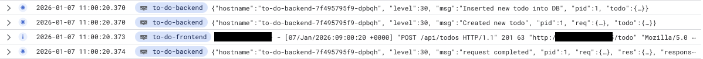

# Devops with Kubernetes

This repository contains my submissions to [MOOC Devops with Kubernetes](https://courses.mooc.fi/org/uh-cs/courses/devops-with-kubernetes).

## k3d environment

Building the local k3d environment that works with the latest release (ping-pong-pv is no longer necessary):

```shell
k3d cluster create kubehelvetti \
  --port 8082:31111@agent:0 \
  -p 8081:80@loadbalancer \
  --agents 2 \
  --volume "/tmp/kubedata/ping-pong-log-output-pv:/tmp/kubedata/ping-pong-log-output-pv@agent:*" \
  --volume "/tmp/kubedata/to-do-assets-pv:/tmp/kubedata/to-do-assets-pv@agent:*"
```

The GKE cluster I used on the course:

```shell
gcloud container clusters create testiklusteri \
  --zone=europe-north1-b \
  --cluster-version=latest \
  --machine-type=e2-medium \
  --num-nodes=1 \
  --enable-autoscaling \
  --min-nodes=1 \
  --max-nodes=3 \
  --disk-size=32
```

## Submissions

The link to the present release might be absent from the release itself but is present in the latest commit.

### Part 1

- [v.0.1.1 Log output](https://github.com/VilleJuhan1/Devops-with-Kubernetes/tree/1.1)
- [v.0.1.2 The project, step 1](https://github.com/VilleJuhan1/Devops-with-Kubernetes/tree/1.2)
- [v.0.1.3 Declarative approach](https://github.com/VilleJuhan1/Devops-with-Kubernetes/tree/1.3)
- [v.0.1.4 The project, step 2](https://github.com/VilleJuhan1/Devops-with-Kubernetes/tree/1.4)
- [v.0.1.5 The project, step 3](https://github.com/VilleJuhan1/Devops-with-Kubernetes/tree/1.5)
- [v.0.1.6 The project, step 4](https://github.com/VilleJuhan1/Devops-with-Kubernetes/tree/1.6)
- [v.0.1.7 External access with Ingress](https://github.com/VilleJuhan1/Devops-with-Kubernetes/tree/1.7)
- [v.0.1.8 The project, step 5](https://github.com/VilleJuhan1/Devops-with-Kubernetes/tree/1.8)
- [v.0.1.9 More services](https://github.com/VilleJuhan1/Devops-with-Kubernetes/tree/1.9)
- [v.0.1.10 Even more services](https://github.com/VilleJuhan1/Devops-with-Kubernetes/tree/1.10)
- [v.0.1.11 Persisting data](https://github.com/VilleJuhan1/Devops-with-Kubernetes/tree/1.11)
- [v.0.1.12 The project, step 6](https://github.com/VilleJuhan1/Devops-with-Kubernetes/tree/1.12)
- [v.0.1.13 The project, step 7](https://github.com/VilleJuhan1/Devops-with-Kubernetes/tree/1.13)

### Part 2

- [v.0.2.1 Connecting pods](https://github.com/VilleJuhan1/Devops-with-Kubernetes/tree/2.1)
- [v.0.2.2 The project, step 8](https://github.com/VilleJuhan1/Devops-with-Kubernetes/tree/2.2)
- [v.0.2.3 Keep them separated](https://github.com/VilleJuhan1/Devops-with-Kubernetes/tree/2.3)
- [v.0.2.4 The project, step 9](https://github.com/VilleJuhan1/Devops-with-Kubernetes/tree/2.4)
- [v.0.2.5. Documentation and ConfigMaps](https://github.com/VilleJuhan1/Devops-with-Kubernetes/tree/2.5)
- [v.0.2.6. The project, step 10](https://github.com/VilleJuhan1/Devops-with-Kubernetes/tree/2.6)
- [v.0.2.7. Stateful applications](https://github.com/VilleJuhan1/Devops-with-Kubernetes/tree/2.7)
- [v.0.2.8. The project, step 11](https://github.com/VilleJuhan1/Devops-with-Kubernetes/tree/2.8)
- [v.0.2.9 The project, step 12](https://github.com/VilleJuhan1/Devops-with-Kubernetes/tree/2.9)
- [v.0.2.10 The project, step 13](https://github.com/VilleJuhan1/Devops-with-Kubernetes/tree/2.10)

### Part 3

- [v.0.3.1, Pingpong GKE](https://github.com/VilleJuhan1/Devops-with-Kubernetes/tree/3.1)
- [v.0.3.2. Back to Ingress](https://github.com/VilleJuhan1/Devops-with-Kubernetes/tree/3.2)
- [v.0.3.3. To the Gateway](https://github.com/VilleJuhan1/Devops-with-Kubernetes/tree/3.3)
- [v.0.3.4. Rewritten routing](https://github.com/VilleJuhan1/Devops-with-Kubernetes/tree/3.4)
- [v.0.3.5. The project, step 14](https://github.com/VilleJuhan1/Devops-with-Kubernetes/tree/3.5)
- [v.0.3.6. The project, step 15](https://github.com/VilleJuhan1/Devops-with-Kubernetes/tree/3.6)
- [v.0.3.7. The project, step 16](https://github.com/VilleJuhan1/Devops-with-Kubernetes/tree/3.7)
- [v.0.3.8. The project, step 17](https://github.com/VilleJuhan1/Devops-with-Kubernetes/tree/3.8)

#### Exercise 3.9. DBaas vs DIY

The exercise requested to make a comparison between two possible database implementations in a cloud environment. The other is DB as a service, or DBaaS, and the other is an own container deployment with the required infrastructure (cronjobs, pvc etc.) We call this the "Do it yourself" solution, or in short, DIY. As this comparison is by nature, not very scientific, I will use various types of sources, from anecdotes to LLMs etc.

Starting with a [reddit conversation](https://www.reddit.com/r/kubernetes/comments/wie6n3/k8s_with_eks_aks_or_gke_considering_a_enterprise/), the OP asks if one should DB related services in cloud. The consensus seem to be that there a pros and cons in both. Service is better if you have the money, own deployment if you have the time. Another user comments that running as much as possible inside a cluster, makes you more cloud-agnostic. From a presentation in [Postgresql EU community site](https://www.postgresql.eu/events/pgdayparis2022/sessions/session/3612/slides/294/PostgreSQL%20in%20the%20Cloud_%20DBaaS%20vs%20Kubernetes.pdf), similar voice can be heard. DBaaS is easy, but not very cost-efficient.

How about on practise though? What are the costs? It seems most cloud provider DBaaS are quite close in [costs](https://benchant.com/blog/postgresql-dbaas-performance-costs). Asking the Copilot to count me the costs of a small instance, 2 vCPU, 8GB RAM, 100GB storage and moderate traffic, using Azure pricing table, have me to following comparison:

| Feature            | AKS (Self‑Managed) | Azure DBaaS |
| ------------------ | -----------------: | ----------: |
| Monthly Cost       |           €10–€110 |   €130–€300 |
| Backups            |       You build it |    Included |
| HA                 |       You build it |    Built‑in |
| Patching           |                You |   Automatic |
| Monitoring         |                You |    Built‑in |
| SLA                |               None |         Yes |
| Operational burden |               High |           — |

The AKS (Azure Kubernetes Service) cost depends highly on if a shared or dedicated node is used and if there's high-availability requirement. The Self-Managed doesn't also factor in the backup costs. When taking into account everything required for self-managed and service, ie. WAL archiving, storage management, monitoring etc., the cost of DBaaS soon becomes soon a non-factor. Still, the knowledge and expertise gain shouldn't either be undervalued. Being able to do everything, and understand the whole stack, is atleast to me, a really valuable position to thrive for. It also makes you agnostic in where you deploy your workloads, atleast in theory.

In summary, DBaaS is still in many aspects the better solution, atleast if you don't have wide knowledge in DB administration or a team for it. Even then, the cost might actually be quite equivalent, because the DBaaS has a competitive edge due to a shared infrastructure. By building everything yourself, you pay also for the overhead, in addition to the labor. For this course, I think taking the DBaaS route could be more fruitful as I've yet to try it. I will be returning to containerized postgresql in other courses, like the Fullstack MOOC end project. I also seem to have ample credits left in the trial, so might as well use them.

- [v.0.3.9. DBaas vs. DIY](https://github.com/VilleJuhan1/Devops-with-Kubernetes/tree/3.9)
- [v.0.3.10. The project, step 18](https://github.com/VilleJuhan1/Devops-with-Kubernetes/tree/3.10)
- [v.0.3.11. The project, step 19](https://github.com/VilleJuhan1/Devops-with-Kubernetes/tree/3.11)

#### Exercise 3.12. The project, step 20

Logging enabled and reviewable in the Logs Explorer in Google Cloud Console:



- [v.0.3.12. The project, step 20](https://github.com/VilleJuhan1/Devops-with-Kubernetes/tree/3.12)

### Part 4

- [v.0.4.1. Readines probe](https://github.com/VilleJuhan1/Devops-with-Kubernetes/tree/4.1)
- [v.0.4.2. The project, step 21](https://github.com/VilleJuhan1/Devops-with-Kubernetes/tree/4.2)

#### Exercise 4.3. Prometheus

The query for listing the pods created by StatefulSets:

```promsql
count(kube_pod_info{namespace="prometheus", created_by_kind="StatefulSet"})
```

- [v.0.4.3. Prometheus](https://github.com/VilleJuhan1/Devops-with-Kubernetes/tree/4.3)
- [v.0.4.4. Your canary](https://github.com/VilleJuhan1/Devops-with-Kubernetes/tree/4.4)
- [v.0.4.5. The project, step 22](https://github.com/VilleJuhan1/Devops-with-Kubernetes/tree/4.5)
- v.0.4.6. The project, step 23 (Nada, skipped atleast for now)
- [v.0.4.7. Baby steps to GitOps](https://github.com/VilleJuhan1/Devops-with-Kubernetes/tree/4.7)
- [v.0.4.8. The project, step 24](https://github.com/VilleJuhan1/Devops-with-Kubernetes/tree/4.8)
- [v.0.4.9. The project, step 25](https://github.com/VilleJuhan1/Devops-with-Kubernetes/tree/4.9)
- [v.0.4.10. The project, the grande finale](https://github.com/VilleJuhan1/Devops-with-Kubernetes/tree/4.10)

### Part 5 (or six I guess)

- v.0.5.1. DIY CRD & Controller (Skipped for now)
- v.0.5.2. Getting started with Istio service mesh (Skipped for now)
- v.0.5.3. Log app, the Service Mesh Edition (Skipped for now)
- [v.0.5.4. Wikipedia with init and sidecar](https://github.com/VilleJuhan1/Devops-with-Kubernetes/tree/5.4)

#### Exercise 5.5. Platform comparison

If you're not a huge enterprise with the required business case and resources, go with Rancher due to the following reasons:

- You can have workloads in multiple environments and manage all of them from a single interface
- You are not vendor locked to RHEL/IBM
- Your CI/CD might already be using typical external tools and Openshift works more like a PaaS so you have to adjust to it
- The cost of Rancher is way less, both the initial cost and the licence costs. Ofc. this also depends on your stack, but generally thinking.
- Developers and administrators might be more used to vanilla Kubernetes and thus require less training
